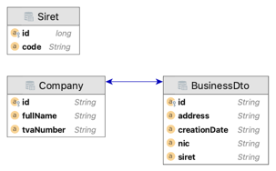
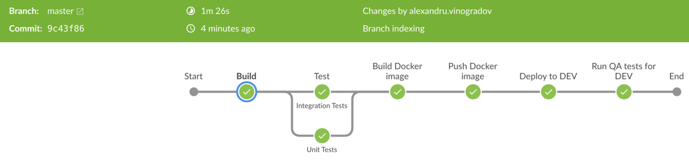
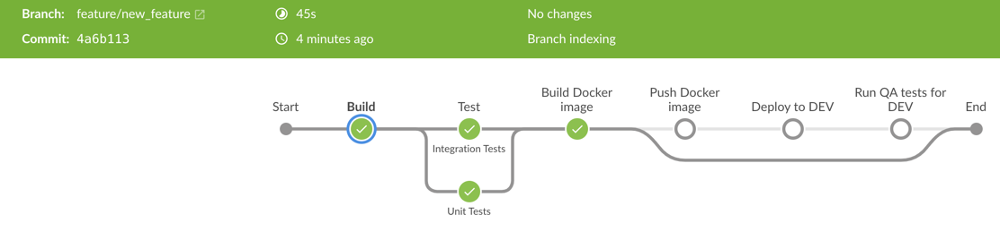

# Business Aggregator 
## Siret Microservice

[](https://github.com/alexvignoble/SiretMicroservice/actions/workflows/main.yml)

Siret Microservice helps aggregate different informations regarding Various businesses corresponding to a SIRET Number.


## Features
It relies on SIRENE public API to retrieve the needed information. It provides certain features to manage different resources:
- CRUD functionalities to manage the SIRET numbers and business information
- "Update" endpoint to retrieve and update the DB with the latest Business information according to the configured SIRET numbers
- On start update of business information based on the default configured SIRET numbers.
- SWAGGER documentation for the provided endpoints.

## Tech

Business Microservice uses a number of open source projects/technologies to work properly:

- Maven
- Spring (Boot, Actuator, JPA, Data Rest, Boot Test)
- Springfox for Swagger generation
- Jackson for JSON Mapping support (for unmarshalling)
- Lombok - Boilerplate code reduction
- SLJ4J - Logging
- JUnit

## Structure
The project is structured as a Maven Project. 
By default the project uses a H2 in-memory DB, this can be changed by modifying the application.properties file. JPA Repositories are being used to abstract the data storage interactions.
For the sake of simplicity, the implementation of the CRUD controllers is defined in the Spring Data Rest way, using the RepositoryRestResource annotation, directly in the repository interfaces.
A custom keystore (Keystore.jks) is used, this contains the trusted certificates which the http client (Spring RestTemplate) is using to query external resources (ex Sirene API)
The application can be packed in a Docker image. For that we have the Dockerfile that describes the image to be delivered.
It contains a Jenkinsfile to describe the declarative pipeline for the Jenkins CICD. For now stages for image push, QA tests, deployments are left as TODOs.
A very minimal workflow that integrates well with GitHub ecosystem (running just the package).

## Data model

The data model is a simple one, containing information related to Sirets, Businesses and Company:


We are following the CQRS pattern. For this, we have the command model (the DTO concrete classes) which are used to unmarshall the data from Sirene and persist it into the data store.
For the query model we take advantage of the projections to define the structure of the exposed data.

## Building and Running

Running the install command at maven project will build the microservice, run the unit and integration tests and pack the jar spring boot application.

Doing a simple
```sh
mvn clean install
```

will run all the above.
The microservice can be started like any spring boot application:
```sh
mvn spring-boot:run
```

There are two maven execution ids which allow you to partially run tests:

- unit tests
  ```sh
    mvn surefire:test@unit-tests
  ```
- integration tests 
  ```sh
    mvn surefire:test@integration-tests
  ```
_Note: The integration tests spin up a real application instance and query the microservice API but use a mock response of the Sirene API, by doing that we have better control on the test data._

## Swagger

When starting the application, the swagger documentation can be accessed by using the root url (for JSON version) or by going to the UI url (for more options):
- http://localhost:8080/

or
- http://localhost:8080/swagger-ui/

## Actuator

Actuator endpoints have been integrated with the application. 13 Endpoints are available and can be accessed by this url http://localhost:8080/actuator
_Note: The shutdown endpoint has been disabled._

## Docker

The project also can be packaged as a docker image and ran as a container.
In the root folder running: 
```sh
docker build . -t <tag>
```
will build a docker image containing a version of the microservice ready to run.

After building the image you can run it using:
```sh
docker run -p 8080:8080 <tag>
```
Note: Portforwarding is needed in order to access the default 8080 port on which the microservice is exposing its endpoints


## Jenkins and Branching Strategy

The pipeline relies on using feature, master. Depending on which branch we are running the pipeline from, we have different behaviours.
For CI the pipeline is common to all branches. Build, unit and integration tests, docker image build are always ran. The resulted docker image is pushed only from master branch.
For CD the pipeline triggers the deployment in DEV environment from master branch. QA tests are triggered after the deployment has been successful.
For TST and PRD deployments a separate pipeline should be used. After DEV release candidate has been created, and the QA stamp of approval, the pipeline will propagate the release candidate from environment to environment.

_Note: Jenkins project should be configured as multi-branch project to trigger runs at new commits._

Build runs should look similar to this:
- For master:
  
- For feature:
  

Before running the pipeline, Jenkins needs to be configured with the following instalations:
- Manage Jenkins -> Global Tool Configuration -> Maven installations
  - Add **_maven_** as a new installation and check the _Install automatically_ checkbox
- Manage Jenkins -> Global Tool Configuration -> Docker installations
  - Add **_docker_** as a new installation, check the _Install automatically_ checkbox and select a stable version
- Manage Jenkins -> Global Tool Configuration -> JDK installations
  - Add **_jdk8_** as a new installation, check the _Install automatically_ checkbox and select java8 or select a local Java8 JDK


### Reference Documentation
For further reference, please consider the following sections:

* [Official Apache Maven documentation](https://maven.apache.org/guides/index.html)
* [Spring Boot](https://docs.spring.io/spring-boot/docs/2.5.4/reference/htmlsingle/)
* [Spring Data Rest](https://docs.spring.io/spring-data/rest/docs/3.5.4/reference/html)
* [Spring Data JPA](https://docs.spring.io/spring-data/jpa/docs/2.5.4/reference/html)
* [Spring Actuator](https://docs.spring.io/spring-boot/docs/current/reference/html/actuator.html)
* [Spring Boot Maven Plugin Reference Guide](https://docs.spring.io/spring-boot/docs/2.5.4/maven-plugin/reference/html/)
* [Springfox](http://springfox.github.io/springfox/docs/current/)
* [Lombok](https://projectlombok.org/features/all)